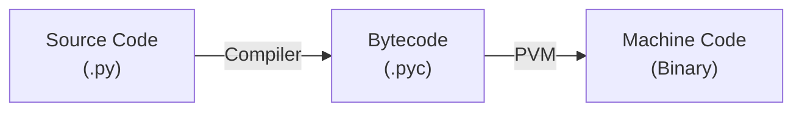

# Python's Compilation and Interpretation

Python is called an **interpreted language**, because its source code is not directly compiled into machine-readable binary code (0 or 1) before running (such as C). Instead, there is an interpreter that translates source code line by line on-the-fly.

---

## 1. Complete Process

The following flow chart shows the process of how Python compiles and interprets source code.

### 1.1 Compilation

When you run a `.py` file, Python first **compiles** the source code into **bytecode** — a lower-level, platform-independent set of instructions. This is done by the Python compiler and the result is stored in `.pyc` files inside the `__pycache__` folder.

Bytecode is **not** machine code (binary). It cannot run directly on hardware. It is an intermediate representation designed for the Python Virtual Machine (PVM).

### 1.2 Interpretation

The **Python Virtual Machine (PVM)** reads the bytecode and interprets it instruction by instruction at runtime, translating each one into actual machine code that the CPU executes.

This is why Python is called an interpreted language — the final step of turning code into machine instructions happens at runtime, not ahead of time.

## Remaining Questions

- What's the meaning of PVM?